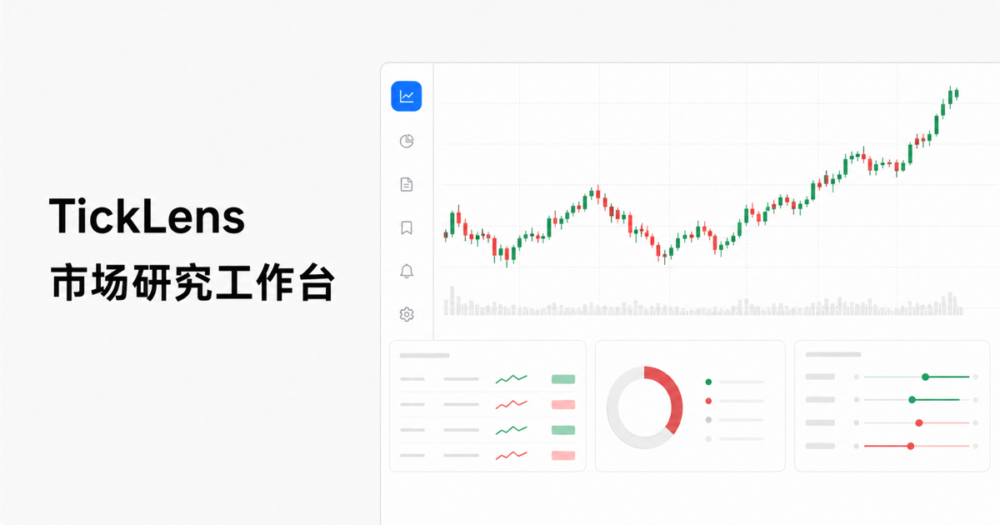

<div align="center">

# TickLens

面向沪深 A 股的开源市场研究工作台

[](https://github.com/weipeng-srz/TransactionData/actions/workflows/ci.yml)
[](./LICENSE)
[](https://nodejs.org/)

</div>



TickLens 把行情、基本面、新闻舆情、技术指标和信号回测放进同一个 Web 研究界面。

> [!WARNING]
> 本项目仅用于学习、数据工程和量化研究，不构成投资建议、收益承诺或交易依据。公开免费数据源可能延迟、限流、变更或出错，请在重要决策前交叉核验。

## 功能

- 输入股票名称或代码，并行获取行情、估值、分红、财务报表和新闻；任一数据源完成后立即更新对应区域。
- 支持多周期 K 线、MA/EMA/BOLL/VWAP、MACD/KDJ/RSI、神奇九转与组合 B/S 研究信号。
- 展示财务趋势、现金流质量、资产质量、估值匹配和规则异常提示。
- 提供新闻情绪初筛、事件标注、信号回测和风险指标。
- 支持明暗主题、基础/专业视图、研究状态保存和 Markdown 报告导出。

## 快速开始

需要 Node.js 22.13+、pnpm 10 和 Git：

```bash
git clone https://github.com/weipeng-srz/TransactionData.git
cd TransactionData
make setup
make dev
```

打开终端显示的本地地址。Web 应用通过同域服务端 API 获取公开行情、财务与新闻数据。

如果系统没有 Make：

```bash
cd web
pnpm install --frozen-lockfile
pnpm dev
```

## 项目结构

```text
.
├── web/
│   ├── app/               # 页面、组件、API 路由和服务端数据客户端
│   ├── db/                # Drizzle/D1 schema
│   ├── drizzle/           # D1 数据库迁移
│   ├── tests/             # 构建后回归测试
│   └── worker/            # Cloudflare Worker 入口
├── docs/                  # 架构、数据格式和数据源说明
├── .github/               # CI、Dependabot、Issue 与 PR 模板
├── Makefile               # Web 开发入口
└── README.md
```

更完整的依赖关系和数据流见 [`docs/architecture.md`](./docs/architecture.md)。

## 数据说明

浏览器只请求仓库内的 `/api/*` 路由；服务端路由再访问新浪财经和东方财富公开接口。历史行情采用 HTTPS 日 K 聚合数据，页面内资金流、B/S 指引、情绪和回测结果均属于研究代理，不能替代授权行情或专业判断。

接口返回字段和计算口径见 [`docs/data-formats.md`](./docs/data-formats.md)，数据来源、限制和合规边界见 [`docs/data-sources.md`](./docs/data-sources.md)。

## 开发与验证

```bash
make lint        # ESLint
make build       # 构建 Web 应用
make test        # 构建并运行全部 Web 测试
make check       # lint + test
```

所有 Pull Request 都会通过 GitHub Actions 运行相同的核心检查。贡献前请阅读 [`CONTRIBUTING.md`](./CONTRIBUTING.md)。

## 文档

| 文档 | 内容 |
| --- | --- |
| [`docs/architecture.md`](./docs/architecture.md) | 系统边界、目录职责和主要数据流 |
| [`docs/data-formats.md`](./docs/data-formats.md) | 服务端接口返回格式与计算口径 |
| [`docs/data-sources.md`](./docs/data-sources.md) | 外部数据源、限制、隐私和合规说明 |
| [`web/README.md`](./web/README.md) | Web 子项目开发、测试与部署约定 |
| [`SECURITY.md`](./SECURITY.md) | 私密漏洞报告方式 |

## 贡献

Bug 报告、功能建议、文档改进和测试补充都很欢迎。较大的数据源、格式或架构变更请先创建 Issue 讨论，以便保持兼容性和数据口径一致。

请遵守 [`CODE_OF_CONDUCT.md`](./CODE_OF_CONDUCT.md)，安全问题请不要公开披露。

## License

本项目按 [MIT License](./LICENSE) 开源。
