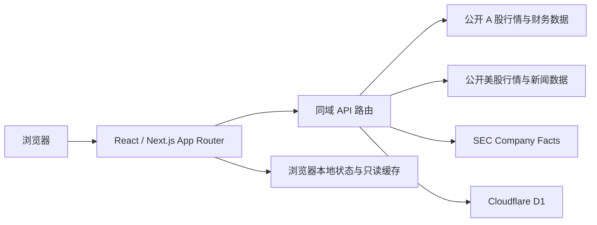

<div align="center">

# TrendSight

面向沪深 A 股与美股的开源市场研究工作台

把行情、财务、新闻、技术信号、风险验证和个人研究记录放进一条可追溯的研究流程。

[](https://github.com/weipeng-srz/TransactionData/actions/workflows/ci.yml)
[](./LICENSE)
[](https://nodejs.org/)
[](https://trendsight-market-workbench.hujingyi2778.chatgpt.site/)

**[立即在线试用 TrendSight →](https://trendsight-market-workbench.hujingyi2778.chatgpt.site/)**

</div>


## 为什么做 TrendSight

传统行情页面擅长展示价格，却常常把研究证据拆散在多个页面：K 线在一个页面，财报在另一个页面，新闻与个人笔记又在别处。TrendSight 希望提供一个更完整的研究工作台：先确认数据是否可用，再理解趋势与风险，最后记录需要复核的证据。

它不是自动交易系统，也不会把模型输出包装成确定结论。页面会同时展示数据覆盖、代理口径、样本数量、回测结果和模型降级状态，帮助使用者区分“已知数据”“规则推断”和“仍需验证的判断”。

> [!WARNING]
> 本项目仅用于学习、数据工程和量化研究，不构成投资建议、收益承诺或交易依据。公开免费数据源可能延迟、限流、变更或出错；行情、资金行为、情绪、预测与回测结果都需要在重要决策前交叉核验。

## 在线体验

访问 **[TrendSight 在线版](https://trendsight-market-workbench.hujingyi2778.chatgpt.site/)**，无需本地安装即可体验当前版本。

建议按下面的路径开始：

1. 在首页搜索股票名称或代码，并加入自选列表。
2. 先使用“基础视图”查看数据状态、核心评分、K 线结论、关键财务指标和近期新闻。
3. 需要更多证据时切换到“专业视图”，查看当前交易日、技术指标、隔日统计、信号回测和高级研究工具。
4. 把核心论点、反方证据、失效条件和复核日期写入研究工作区，或导出 Markdown 研究报告。

在线版依赖公开数据源与托管服务，偶发的数据延迟或局部加载失败不代表所有研究模块不可用。

## 核心能力

### 自选与组合观察

- 统一搜索沪深 A 股和美股，维护自选列表与最近访问记录。
- 展示持仓市值、累计收益、当日盈亏和组合集中度；CNY 与 USD 默认分开汇总。
- 支持持仓 CSV 导入、导出和本地编辑；人民币折算视图必须由用户显式启用并提供汇率。
- 首页提供“今日三件事”和全球市场脉动，优先暴露数据状态、收益风险与下一步核验动作。

### 行情与技术研究

- 支持多周期 K 线，以及 MA、EMA、BOLL、VWAP、MACD、KDJ、RSI 等常用指标。
- 提供神奇九转和组合 B/S 研究信号，并明确标注规则代理属性。
- A 股专业视图可展示当前交易日分钟 K、五档盘口和 Level-1 成交明细下载；这些数据不等同于交易所 Level-2 逐笔订单。
- 支持图表缩放、拖动、区间收益、最大回撤、波动率和基准相对表现研究。

### 财务与估值诊断

- 对比最近披露期的营收、利润、现金流、资产负债、盈利质量和资本效率。
- 区分累计报告值、单季度值与 TTM 指标，避免把不同口径直接混用。
- 提供财务规则异常、改善信号、估值匹配、同业横比和披露时间线。
- 每条财务结论尽量保留报告期、原始字段和来源说明，便于回到证据核验。

### 新闻、风险与研究工作区

- 对新闻做去重、相关性筛选、时点过滤和情绪初筛，并显示数据可信度与截止时间。
- 将收益拆解为风险、相对表现、因子暴露和事件窗口影响。
- 保存股票级投资论点、反方证据、失效条件、复核日期和图表标注。
- 导出 K 线 CSV、Markdown 研究报告，或通过浏览器打印生成 PDF。

### 自适应隔日统计实验

- 支持“昨日完整日 K → 今日”和“今日实时 OHLCV → 明日”两种研究切片。
- 组合规则后验、时间衰减的历史相似日、Logistic 方向模型和 Ridge 收益区间模型。
- 将大盘趋势、波动率、个股相对强弱和时点过滤后的新闻情绪纳入上下文。
- 展示三种概率场景、相似日收益分布、成交活跃度、统计观察带与风险收益比。
- 通过 Walk Forward 的 Accuracy、ROC-AUC、Brier Score 和样本门槛控制 ML 权重；验证不足时自动降级为规则与相似日模型。

## 基础视图与专业视图

| 能力 | 基础视图 | 专业视图 |
| --- | --- | --- |
| 适合场景 | 快速了解一只股票，建立阅读顺序 | 深入验证假设、风险和模型证据 |
| 数据状态与新手引导 | 完整展示 | 完整展示 |
| K 线与核心研判 | 关键结论与主要观察位 | 完整指标、数据摘要和交互工具 |
| 财务与新闻 | 核心 KPI、精选新闻 | 完整财务矩阵、信号、同业和全部新闻 |
| 当前交易日与盘口 | 按需隐藏 | A 股分钟 K、五档盘口和 Level-1 代理 |
| 隔日统计与回测 | 按需隐藏 | 概率实验、Walk Forward 与信号回测 |
| 高级研究工作区 | 按需隐藏 | 风险、因子、事件、标注与研究备忘录 |

基础视图不是“简化数据口径”，而是减少同时出现的模块；切换视图不会改变已经加载的原始行情和财务数据。

## 快速开始

### 环境要求

- Node.js 22.13+
- pnpm 10
- Git

### 使用 Make

```bash
git clone https://github.com/weipeng-srz/TransactionData.git
cd TransactionData
make setup
make dev
```

打开终端显示的本地地址。开发服务会先幂等执行本地 D1 迁移，再启动 Web 应用。

### 不使用 Make

```bash
git clone https://github.com/weipeng-srz/TransactionData.git
cd TransactionData/web
pnpm install --frozen-lockfile
pnpm dev
```

本地预览使用固定的 `local-preview` 用户键模拟研究状态存储，不需要配置登录系统。

### 可选配置

生产环境建议设置 `SEC_USER_AGENT`，使用符合美国 SEC 要求的应用名称和联系邮箱。不要把 `.env*`、`.dev.vars*`、`.wrangler/`、`dist/` 或访问凭据提交到仓库。

更多本地数据库和托管说明见 [`web/README.md`](./web/README.md)。

## 技术架构


```mermaid
flowchart LR
    U[浏览器] --> UI[React / Next.js App Router]
    UI --> API[同域 API 路由]
    API --> CN[公开 A 股行情与财务数据]
    API --> US[公开美股行情与新闻数据]
    API --> SEC[SEC Company Facts]
    API --> D1[Cloudflare D1]
    UI --> LOCAL[浏览器本地状态与只读缓存]
```

- **界面层**：React 19、Next.js App Router、TypeScript。
- **构建与运行时**：vinext、Vite、Cloudflare Workers。
- **数据与状态**：同域 API、Drizzle ORM、Cloudflare D1、浏览器 Cache API 与 Local Storage。
- **设计原则**：数据源失败隔离、市场身份隔离、稳定响应格式、最小持久化和可替换的上游边界。

浏览器不会直接请求第三方数据源。服务端 API 负责输入校验、超时与响应大小限制、上游格式解析和稳定格式输出。行情、财务和新闻并行加载，单个数据源失败不会阻塞其他已完成区域。

更完整的数据流和模块职责见 [`docs/architecture.md`](./docs/architecture.md)。

## 项目结构

```text
.
├── web/
│   ├── app/
│   │   ├── api/          # 行情、财务、新闻、研究状态与遥测 API
│   │   ├── components/   # 图表、组合、财务和研究组件
│   │   └── lib/          # 数据客户端、解析、指标与领域逻辑
│   ├── db/               # Drizzle / D1 schema
│   ├── drizzle/          # D1 数据库迁移
│   ├── tests/            # 构建后回归测试
│   └── worker/           # Cloudflare Worker 入口
├── docs/                 # 架构、数据格式、数据源与验证记录
├── .github/              # CI、Dependabot、Issue 与 PR 模板
├── Makefile              # 开发与验证入口
└── README.md
```

## 数据来源与边界

| 数据类别 | 当前用途 | 主要限制 |
| --- | --- | --- |
| 新浪财经公开数据 | A 股与美股行情、复权因子和新闻检索 | 可能延迟、限流或调整字段 |
| 东方财富、腾讯公开数据 | 证券检索、财务、估值、分红、A 股实时行情与 Level-1 代理 | 不等同于授权 Level-2 数据 |
| 搜狐财经公开数据 | 上证指数日 K、沪深市场成交额参考 | 仅用于市场背景研究 |
| 美国 SEC Company Facts | 美股申报财务数据 | 以公司申报口径为准，非实时数据 |
| Cloudflare D1 | 研究状态与匿名聚合遥测 | 不保存第三方原始行情数据 |

所有金额均保留证券所属市场的原始币种。CNY 与 USD 不会被隐式合并；跨币种组合观察必须由用户主动提供汇率。

接口字段与计算口径见 [`docs/data-formats.md`](./docs/data-formats.md)，数据源、限制、隐私和合规边界见 [`docs/data-sources.md`](./docs/data-sources.md)。

## 隐私与状态存储

- 最近查询、自选、持仓、界面偏好和部分离线回退数据保存在浏览器本地。
- 云端 `research_states` 保存需要跨设备同步的研究状态。
- 托管环境以用户邮箱的 SHA-256 派生值作为用户键，不把邮箱原文写入 D1。
- 匿名遥测只保存白名单事件的每日次数和耗时汇总，不记录查询股票或研究内容。
- 在共享设备上使用在线版后，应主动清理浏览器站点数据。

## 开发与验证

```bash
make lint        # ESLint
make build       # 构建 Web 应用
make test        # 构建并运行全部 Web 测试
make check       # lint + test
```

也可以在 `web/` 目录直接运行对应的 `pnpm lint`、`pnpm build` 和 `pnpm test`。所有 Pull Request 都会通过 GitHub Actions 运行相同的核心检查。

## 常见问题

<details>
<summary><strong>页面上的“上涨概率”和“研究评分”可以直接用于交易吗？</strong></summary>

不可以。它们是基于公开数据、有限样本、规则和统计模型生成的研究辅助结果，不是收益承诺或自动交易指令。请同时核验数据时点、样本覆盖、公司公告、交易成本和自身风险承受能力。

</details>

<details>
<summary><strong>为什么部分模块会显示数据不足或自动降级？</strong></summary>

不同证券的数据覆盖和交易历史并不一致。TrendSight 会在样本不足、验证指标未达门槛或上游不可用时显式降低模型权重、隐藏不可靠结论或展示最近可用数据，而不是用合成值填充。

</details>

<details>
<summary><strong>支持 Level-2、券商账户或自动下单吗？</strong></summary>

不支持。当前 A 股盘口与成交明细来自公开 Level-1 代理，美股也不提供五档盘口。项目不连接券商交易账户，不包含自动下单能力。

</details>

<details>
<summary><strong>为什么在线版偶尔只有部分区域加载成功？</strong></summary>

行情、财务和新闻来自不同公开数据源，并采用失败隔离和并行加载。某个数据源限流或暂时不可用时，其他区域仍可继续使用；请根据页面的数据状态和更新时间判断结论是否需要重新核验。

</details>

## 文档

| 文档 | 内容 |
| --- | --- |
| [`docs/architecture.md`](./docs/architecture.md) | 系统边界、目录职责和主要数据流 |
| [`docs/data-formats.md`](./docs/data-formats.md) | 服务端接口返回格式与计算口径 |
| [`docs/data-sources.md`](./docs/data-sources.md) | 外部数据源、限制、隐私和合规说明 |
| [`web/README.md`](./web/README.md) | Web 子项目开发、测试与部署约定 |
| [`SECURITY.md`](./SECURITY.md) | 私密漏洞报告方式 |

## 贡献

Bug 报告、功能建议、文档改进和测试补充都很欢迎。较大的数据源、格式或架构变更请先创建 Issue 讨论，以便保持兼容性和数据口径一致。

贡献前请阅读 [`CONTRIBUTING.md`](./CONTRIBUTING.md) 和 [`CODE_OF_CONDUCT.md`](./CODE_OF_CONDUCT.md)。安全问题请按照 [`SECURITY.md`](./SECURITY.md) 私密报告，不要在公开 Issue 中披露。

## License

本项目按 [MIT License](./LICENSE) 开源。
