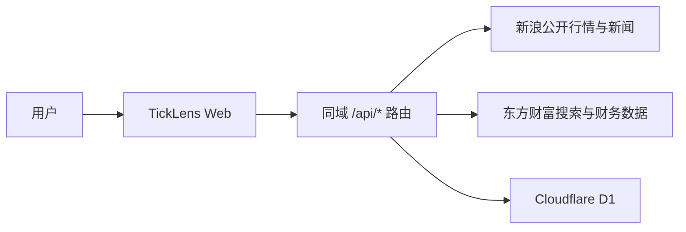

# 架构说明

TickLens 是一个 Web 研究工作台。浏览器负责交互和本地分析；Next.js App Router API 负责校验请求、聚合公开数据源以及访问 Cloudflare D1；vinext 将应用构建为 Cloudflare Worker 兼容产物。

## 组件关系

浏览器不直接访问第三方数据源。所有外部请求集中在服务端客户端模块，避免把上游协议、请求头和响应解析散落到界面组件中。

## Web 请求路径

1. `app/page.tsx` 维护查询状态，并通过同域 API 查询证券简称。
2. 股票代码确定后，页面并行请求历史行情、基本面和新闻；实时行情走独立轮询。
3. `app/api/` 校验请求大小和股票代码，再调用 `app/lib/remote*.ts`、`financials.ts` 等服务端模块访问外部数据源。
4. 服务端把不同上游响应转换为稳定的 CSV 或 JSON；前端解析模块再统一为图表和研究组件使用的领域模型。
5. 研究状态和匿名聚合遥测通过 Drizzle 写入 D1。

## 目录职责

| 目录 | 职责 |
| --- | --- |
| `web/app/api` | 行情、财务、新闻、研究状态和遥测 API |
| `web/app/lib` | 上游数据客户端、解析、指标、研究和存储逻辑 |
| `web/app/components` | 图表、财务、研究和交易面板 |
| `web/db` | Drizzle/D1 schema 与连接封装 |
| `web/drizzle` | D1 SQL 迁移 |
| `web/worker` | HTTP 请求入口 |
| `web/tests` | 构建后回归测试 |

## 持久化

- `research_states`：每个用户一份版本化研究状态。
- `telemetry_daily`：仅保存白名单事件的每日计数和耗时汇总，不保存股票代码或用户标识。

托管环境通过 `oai-authenticated-user-email` 请求头识别用户，数据库只保存邮箱的 SHA-256 派生键；本地预览使用固定的 `local-preview` 用户键。

## 关键设计原则

- **失败隔离**：行情、新闻和财务并发加载，单个数据源失败不会阻止其他区域更新。
- **输入边界**：API 路由限制请求大小、股票代码格式和批量数量。
- **上游保护**：服务端请求设置超时、响应大小上限和安全的响应解析。
- **离线回退**：历史行情和新闻成功响应会进入浏览器 Cache API，网络失败时可短期只读回退。
- **最小持久化**：浏览器偏好留在本地；云端只保存需要跨设备同步的状态和聚合遥测。
- **可替换边界**：外部数据源访问集中在客户端模块和 API 路由，便于测试和后续替换。

## 变更指南

- 新增外部数据源时，把网络协议、响应解析和 UI 展示分开，并为异常响应添加测试。
- 修改接口 CSV、JSON 或 D1 schema 时，需要兼容旧数据、更新专题文档并添加迁移或回归测试。
