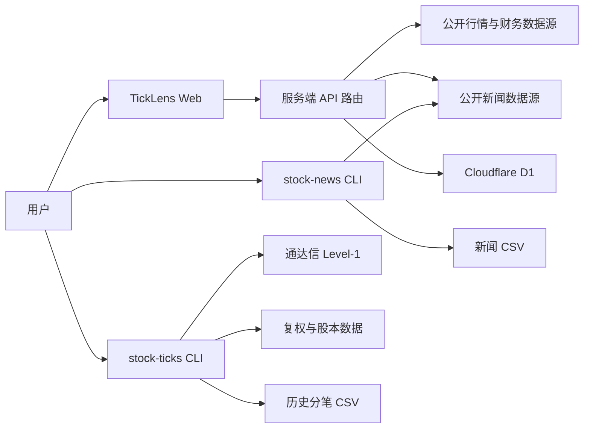

# 架构说明

TickLens 是一个单仓库项目，由两个独立 Go 命令和一个 Web 研究工作台组成。Go 模块负责高精度历史数据导出；Web 模块负责交互式研究、远端数据聚合和用户状态。

## 组件关系

Web 与 Go 命令共享产品目标和数据口径，但运行时互不依赖：干净克隆后可以只运行 Web，也可以只构建任一 Go 命令。

## Go 模块

### 命令入口

- `cmd/stock-ticks`：解析参数、连接通达信、扫描完整交易日、补充复权与股本信息并写出 CSV。
- `cmd/stock-news`：解析参数、解析证券代码、并行检索新闻、聚合告警并写出 CSV。

### 内部包

| 包 | 职责 |
| --- | --- |
| `internal/stock` | 股票代码规范化、市场识别和展示格式 |
| `internal/tdx` | 通达信协议连接、请求和二进制解码 |
| `internal/marketdata` | 分笔成交领域模型 |
| `internal/companydata` | 前复权因子、证券简称和流通股本 |
| `internal/exportcsv` | 历史分笔 CSV 校验与原子写入 |
| `internal/news` | 新闻检索、去重、情绪分析和 CSV 写入 |

包放在 `internal/` 下，明确表示当前没有承诺稳定的 Go 公共库 API。外部用户应通过两个命令或其 CSV 输出集成。

## Web 模块

### 请求路径

1. `app/page.tsx` 维护查询状态，并并行请求行情、基本面、新闻和实时行情路由。
2. `app/api/` 校验请求大小和股票代码，再调用 `app/lib/remote*.ts` 等服务端模块访问外部数据源。
3. 数据解析模块把不同响应统一为前端领域模型；图表和分析组件只依赖统一模型。
4. 研究状态和价格提醒在具有用户身份时写入 D1；本地预览使用独立的本地键。

### 持久化

- `research_states`：每个用户一份版本化研究状态。
- `price_alerts`：最多 30 个用户价格提醒；Worker 定时任务分批刷新未触发提醒。
- `telemetry_daily`：仅保存白名单事件的每日计数和耗时汇总，不保存股票代码或用户标识。

数据库结构由 `db/schema.ts` 管理，SQL 迁移位于 `drizzle/`。构建插件会把迁移与托管声明一起打包。

## 关键设计原则

- **数据口径优先**：缺少复权因子或股本时，CLI 会停止导出，而不是生成看似完整的数据。
- **失败隔离**：Web 各数据源独立加载；单个新闻入口失败时，CLI 仍保留其他入口结果。
- **原子输出**：两个 CSV 写入器都先完成临时文件，再替换目标文件。
- **最小持久化**：浏览器偏好留在本地；云端只保存需要跨设备同步的状态和聚合遥测。
- **可替换边界**：外部数据源访问集中在客户端模块和 API 路由，便于测试和后续替换。

## 变更指南

- 新增 Go 命令放在 `cmd/<name>`，可复用逻辑放在 `internal/<domain>`。
- 新增 Web 外部数据源时，把网络协议、解析和 UI 展示分开，并为异常响应添加测试。
- 修改 CSV 或 D1 schema 时，需要兼容旧数据、更新专题文档并添加迁移或回归测试。
